# Info

Files in this directory use MermaidJS format. To edit them, just copy-paste them into the editor at [mermaidchart.com](https://mermaidchart.com). When you are done copy the changes and exported SVG back to this repo and commit the changes.

### Current Charts

Click on the charts and then click "Raw" to view them in real size.

